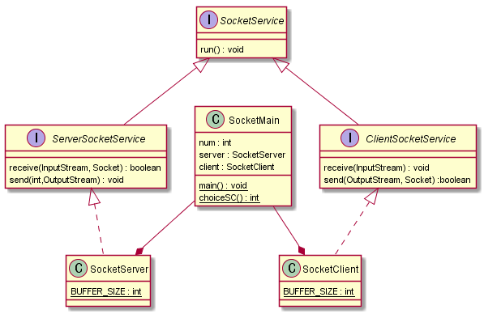

@startuml
interface SocketService{
    run() : void
}

interface ServerSocketService extends SocketService{
    receive(InputStream, Socket) : boolean
    send(int,OutputStream) : void
}

interface ClientSocketService extends SocketService{
	receive(InputStream) : void
	send(OutputStream, Socket) :boolean
}

class SocketClient implements ClientSocketService{
    {static} BUFFER_SIZE : int
}

class SocketServer implements ServerSocketService{
    {static} BUFFER_SIZE : int
}

class SocketMain{
    num : int
    server : SocketServer
    client : SocketClient
    {static} main() : void
    {static} choiceSC() : int
}

SocketMain --* SocketServer
SocketMain --* SocketClient
@enduml

---
