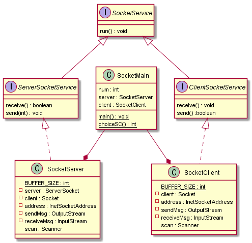

@startuml
interface SocketService{
    run() : void
}

interface ServerSocketService extends SocketService{
    receive() : boolean
    send(int) : void
}

interface ClientSocketService extends SocketService{
	receive() : void
	send() :boolean
}

class SocketClient implements ClientSocketService{
    {static} BUFFER_SIZE : int
    - client : Socket
    - address : InetSocketAddress
    - sendMsg : OutputStream
    - receiveMsg : InputStream
      scan : Scanner
}

class SocketServer implements ServerSocketService{
    {static} BUFFER_SIZE : int
    - server : ServerSocket
    - client : Socket
    - address : InetSocketAddress
    - sendMsg : OutputStream
    - receiveMsg : InputStream
      scan : Scanner
}

class SocketMain{
    num : int
    server : SocketServer
    client : SocketClient
    {static} main() : void
    {static} choiceSC() : int
}

SocketMain --* SocketServer
SocketMain --* SocketClient
@enduml

========================================================================
