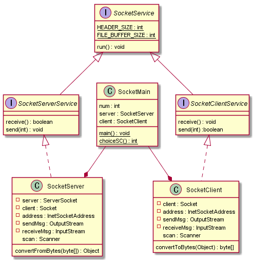

@startuml
interface SocketService{
    {static} HEADER_SIZE : int
    {static} FILE_BUFFER_SIZE : int
    run() : void
}

interface SocketServerService extends SocketService{
    receive() : boolean
    send(int) : void
}

interface SocketClientService extends SocketService{
	receive() : void
	send(int) :boolean
}

class SocketClient implements SocketClientService{
    - client : Socket
    - address : InetSocketAddress
    - sendMsg : OutputStream
    - receiveMsg : InputStream
      scan : Scanner

      convertToBytes(Object) : byte[]
}

class SocketServer implements SocketServerService{
    - server : ServerSocket
    - client : Socket
    - address : InetSocketAddress
    - sendMsg : OutputStream
    - receiveMsg : InputStream
      scan : Scanner

     convertFromBytes(byte[]) : Object
}

class SocketMain{
    num : int
    server : SocketServer
    client : SocketClient
    {static} main() : void
    {static} choiceSC() : int
}

SocketMain --* SocketServer
SocketMain --* SocketClient
@enduml

---
