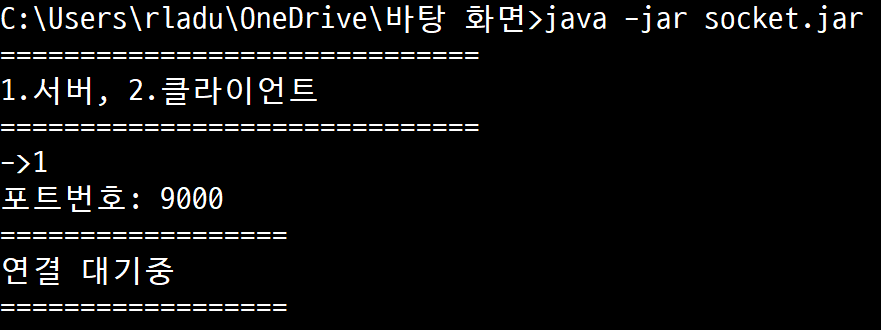
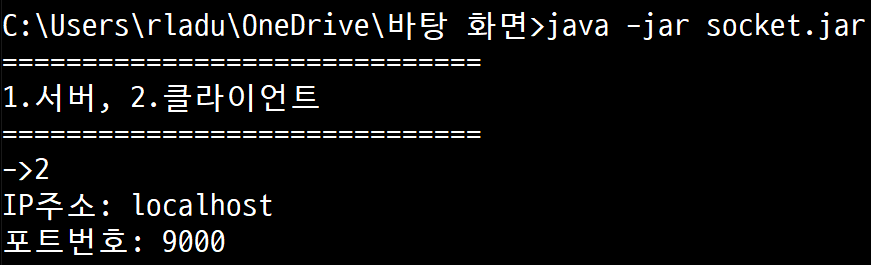
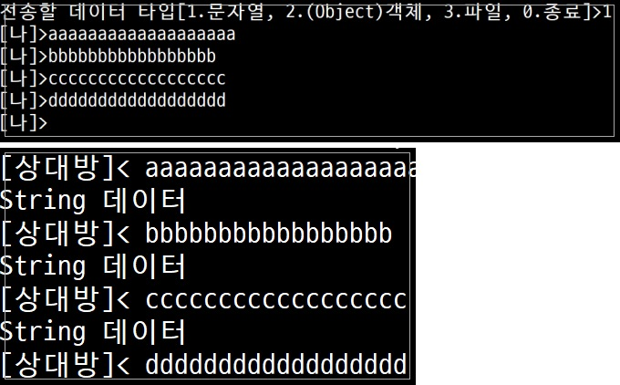
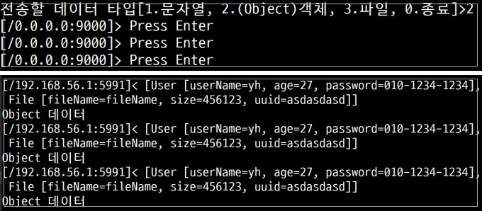
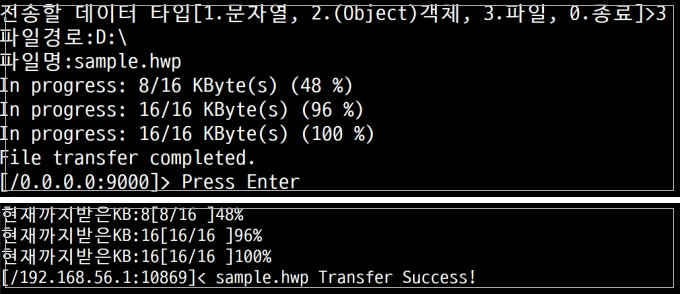

# Socket기능명세서
|버전|설계서|날짜|설명|
|------|----|---|------|
|[ver1](ver1.md)|[설계서ver1](../설계서/ver1.md)|2020/08/18|서버와 클라이언트 간에 어떤 문자열이든 전송이 가능하게 구현|
|[ver2](ver2.md)|[설계서ver2](../설계서/ver2.md)|2020/08/19|서버와 클라이언트 간에 어떤 객체든 전송이 가능하게 구현|
|[ver2_1](ver2_1.md)|[설계서ver2_1](../설계서/ver2_1.md)|2020/08/19|서버와 클라이언트 클래스 지역변수를 멤버변수로 변경|
|[ver3](ver3.md)|[설계서ver3](../설계서/ver3.md)|2020/08/20|서버와 클라이언트 간에 모든 File을 전송할 수 있게 구현|
|[ver4](ver4.md)|[설계서ver4](../설계서/ver4.md)|2020/08/24|클라이언트 <-> 서버 간에 자유롭게 통신이 가능한 양방향 통신으로 구현|
---
## 목록
 - [1. 서버소켓](#1.서버소켓)
   - [1-1. 서버소켓 실행](#1.1서버소켓-실행)
 - [2. 클라이언트소켓](#2.클라이언트소켓)
   - [2-1. 클라이언트소켓 실행](#2-1.클라이언트소켓-실행) 
 - [3. 연결성공](#3.연결성공)
   - [3-1. 서버화면](#3-1.서버-화면)
   - [3-2. 클라이언트화면](#3-2.클라이언트-화면)
 - [4. 전송(해야됨)](#4.전송)
   - [4-1. 문자열전송](#4-1.문자열전송)
   - [4-2. 객체전송](#4-2.객체전송)
   - [4-3. 파일전송](#4-3.파일전송)
 - [5. Thread 구조](#5.Thread-구조)
 - [6. ClassDiagram(해야됨)](#6.ClassDiagram) 
---
## 1.서버소켓

### 1-1.서버소켓 실행

1. Socket 프로젝트의 메인함수를 실행한다.

   ``` java -jar socket.jar```

2. 1번을 입력한다. (1:서버, 2:클라이언트)
3. 서버의 포트번호를 입력한다.
4. 클라이언트와 연결에 성공할때까지 기다린다.



---
## 2.클라이언트소켓

### 2-1.클라이언트소켓 실행

1. Socket 프로젝트의 메인함수를 실행한다.

   ``` java -jar socket.jar```

2. 2번을 입력한다. (1:서버, 2:클라이언트)
3. 연결할 서버의 IP주소를 입력한다.
4. 연결할 서버의 포트번호를 입력한다.
5. 서버와 연결에 성공할때까지 기다린다.



---

## 3.연결성공

### 3-1.서버 화면
연결에 성공할 경우 서버 콘솔에는 클라이언트와 연결되었다고 나타나고 연결된 클라이언트의 IP주소와 Port번호가 나타난다. 

이때 숫자를 입력하면 원하는 형태의 데이터를 전송할 수 있다.

```java
//열거형 상수로 나타낸 데이터 타입
public enum DataType {
	CONNECTION_START,TYPE_STRING,TYPE_OBJECT,TYPE_FILE;
}
```


---
### 3-2.클라이언트 화면
연결에 성공할 경우 클라이언트 콘솔에는 서버와 연결되었다고 나타나고 서버의 IP주소와 Port번호가 나타난다. 

서버와 마찬가지로 숫자를 입력하면 원하는 형태의 데이터를 전송할 수 있다. (**전이중통신**)

(1:String, 2:Object, 3:File, 4:종료)

```java
//열거형 상수로 나타낸 데이터 타입
public enum DataType {
	CONNECTION_START,TYPE_STRING,TYPE_OBJECT,TYPE_FILE;
}
```


# 4.전송
데이터를 전송을 하기 위해 헤더에 데이터의 정보를 저장한 뒤 헤더값을 먼저 보낸다.

헤더값에는 `데이터의 크기, 데이터의 타입, 파일경로, 파일이름, 확장자`가 저장된다.

헤더 값을 보낸뒤 곧 바로 데이터를 보낸다.

//헤더와 DataType의 연관관계 그림으로 나타내기

---
## 4-1.문자열전송

문자열을 전송하기를 선택하면 `SendThread` 객체가 먼저 실행되고 SendThread객체의 `send(1)`메소드가 실행이 된다.

send()메소드의 실행 로직은 다음과 같다.

```java
//Send() 메소드

//전송할 문자열 입력받음
System.out.print("[나]>");
String msg = scan.nextLine();

//입력받은 문자열을 바이트로 변환
byte[] content = msg.getBytes();
try {
    //헤더에 문자열의 크기, 데이터 타입을 저장해 보냄
    Header header = new Header(content.length, DataType.TYPE_STRING);
    sendMsg.write(convertToBytes(header));
    sendMsg.flush();
    
    //헤더를 보낸 뒤 문자열 데이터 전송
    sendMsg.write(content);
    sendMsg.flush();
} catch (IOException e) {
    // TODO Auto-generated catch block
    e.printStackTrace();
}
```

문자열을 받으려면 받는 쪽(전이중통신이므로 클라이언트, 서버 둘 다 해당)에서는 `ReceiveThread` 객체가 실행되고 ReceiveThread객체의 `receive()` 메소드가 실행이 된다.

receive()메소드의 실행 로직은 다음과 같다.
```java
//헤더객체를 먼저 Object로 전송 받는다.
byte[] byteHeader = new byte[HEADER_SIZE];
receiveMsg.read(byteHeader,0,byteHeader.length);
//Object객체를 Header객체로 타입캐스팅한다.
Header header = (Header)convertFromBytes(byteHeader);

//헤더의 dataType이 문자열인 경우 실행 

//데이터의 크기만큼 byte 배열의 크기를 할당
byte[] data = new byte[(int)header.getDataSize()];

//데이터를 바이트로 받은 뒤 문자열로 변경
receiveMsg.read(data,0,data.length);
String msg = new String(data);
//받은 문자열 콘솔에 출력
System.out.println("[상대방]< "+msg);
```



---

## 4-2.객체전송

객체를 전송하기를 선택하면 `SendThread` 객체가 먼저 실행되고 SendThread객체의 `send(2)`메소드가 실행이 된다.

send(2)메소드의 실행 로직은 다음과 같다.
```java
//list 객체를 byte 배열로 변환
byte[] content = convertToBytes(list);
//헤더에 객체의 크기, 데이터 타입을 저장해 보냄 			
Header header = new Header(content.length, DataType.TYPE_OBJECT);
sendMsg.write(convertToBytes(header));
sendMsg.flush();

//헤더를 보낸 뒤 객체를 전송 
sendMsg.write(content);
sendMsg.flush();
```

객체를 받으려면 받는 쪽(전이중통신이므로 클라이언트, 서버 둘 다 해당)에서는 `ReceiveThread` 객체가 실행되고 ReceiveThread객체의 `receive()` 메소드가 실행이 된다.

receive()메소드의 실행 로직은 다음과 같다.
```java
//헤더객체를 먼저 Object로 전송 받는다.
byte[] byteHeader = new byte[HEADER_SIZE];
receiveMsg.read(byteHeader,0,byteHeader.length);
//Object객체를 Header객체로 타입캐스팅한다.
Header header = (Header)convertFromBytes(byteHeader);

//헤더의 dataType이 객체인 경우 실행 

//데이터의 크기만큼 byte 배열의 크기를 할당
byte[] data = new byte[(int)header.getDataSize()];
//데이터를 바이트로 받은 뒤 객체로 변경
receiveMsg.read(data,0,data.length);
Object obj = convertFromBytes(data);
//받은 객체를 콘솔에 출력
System.out.println("["+client.getRemoteSocketAddress().toString()+"]< "+obj);
```



---

## 4-3.파일전송

파일 전송하기를 선택하면 `SendThread` 객체가 먼저 실행되고 SendThread객체의 `send(3)`메소드가 실행이 된다.

메소드가 실행되면 파일경로, 파일명을 입력 받고 해당파일을 File객체에 저장한다.

그 뒤 파일을 byte 배열로 변환한 뒤 미리 할당한 8*1024 byte 크기 만큼 나눠서 전송한다. 

send(3)메소드의 실행 로직은 다음과 같다.
```java
//전송할 파일 폴더 경로를 입력 받음
System.out.print("파일경로:");
String filePath = scan.nextLine();

//파일 이름은 직접 입력 받음
System.out.print("파일명:");
String fileName = scan.nextLine();

//File객체에 파일을 저장
File file = new File(filePath+fileName);

//전송할 파일을 담을 바이트배열
byte[] content = new byte[FILE_BUFFER_SIZE];
//헤더값엔 데이터 크기, 타입, 이름,확장자(파일일 경우만)이 저장됨
Header header = new Header(file.length(),DataType.TYPE_FILE,filePath,fileName,fileName.substring(fileName.indexOf(".")+1));
//총 전송량, 현재 보내는 값
long totalReadBytes=0;
int readBytes;
try { 
    //헤더를 먼저 전송
    sendMsg.write(convertToBytes(header));
    sendMsg.flush();
    //파일 전송을 위해 파일을 FileinputStream에 저장
    FileInputStream sendFile = new FileInputStream(file);
    //보낼 데이터가 0이 되면 전송 종료
    while ((readBytes = sendFile.read(content)) > 0) {
        //한번에 FILE_BUFFER_SIZE(=1024) 만큼 데이터 전송
        sendMsg.write(content, 0, readBytes);

        //콘솔 출력용
        totalReadBytes += readBytes;
        System.out.println("In progress: " + totalReadBytes/1024 + "/"
                + file.length()/1024 + " KByte(s) ("
                + (totalReadBytes * 100 / file.length()) + " %)");
    }
    //파일 전송이 완료되면 콘솔에 출력
    System.out.println("File transfer completed.");
```

파일을 받으려면 받는 쪽(전이중통신이므로 클라이언트, 서버 둘 다 해당)에서는 `ReceiveThread` 객체가 실행되고 ReceiveThread객체의 `receive()` 메소드가 실행이 된다.

메소드가 실행 되면 미리 빈파일을 만들어 둔 뒤 미리 할당한 8*1024 byte 크기 만큼 나눠서 받는다.

receive()메소드의 실행 로직은 다음과 같다.

```java
//헤더객체를 먼저 Object로 전송 받는다.
byte[] byteHeader = new byte[HEADER_SIZE];
receiveMsg.read(byteHeader,0,byteHeader.length);
//Object객체를 Header객체로 타입캐스팅한다.
Header header = (Header)convertFromBytes(byteHeader);

//헤더의 dataType이 파일인 경우 실행 

//미리 선언한 파일 버퍼 사이즈인 8*1024 byte 만큼 byte배열을 할당한다.
byte[] data = new byte[FILE_BUFFER_SIZE];	

//빈 파일을 먼저 생성
FileOutputStream sendFile = new FileOutputStream("D:\\down\\"+header.getFileName());
int readBytes;
long total= 0;

//생성된 빈 파일에 데이터를 전송 시킴
while(true) {
    readBytes = receiveMsg.read(data);
    sendFile.write(data, 0, readBytes);
    total+=readBytes;
    System.out.println("현재까지받은KB:["+(total/1024)+"/"+(header.getDataSize()/1024)+" ]"+((long)(total*100)/header.getDataSize())+"%");
    if(readBytes<FILE_BUFFER_SIZE) {
        break;
    }
}
System.out.println("["+client.getRemoteSocketAddress().toString()+"]< "+header.getFileName()+" Transfer Success!");

```



---

## 5.Thread 구조

---
## 6.ClassDiagram